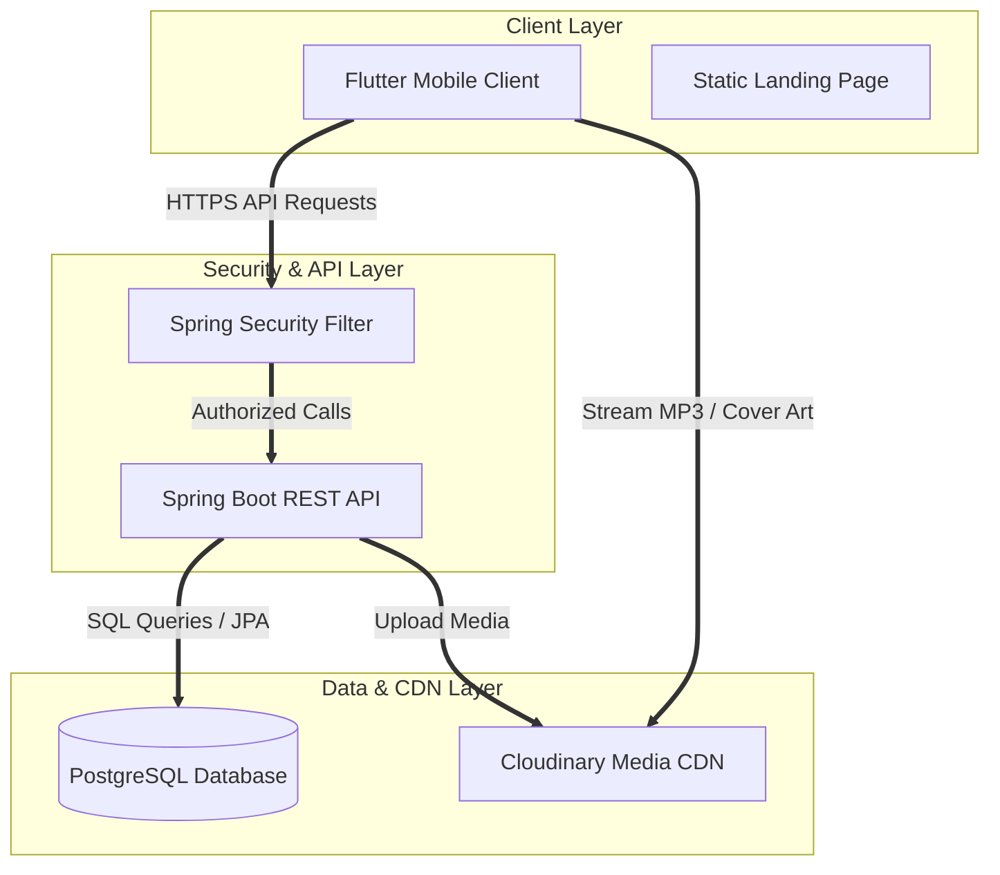

# Musiverse 🎵

> *Feel the music*

Musiverse is a premium, immersive music streaming and sharing platform designed for music lovers and content creators. The repository contains a full-stack system consisting of a Java Spring Boot backend, a Flutter-based mobile client app, and a sleek, neon-themed static landing website.

---

## 📁 Repository Structure

```
Musiverse/
├── backend/            # Java Spring Boot backend service
├── frontend/           # Flutter & Dart mobile client application
├── landing-page/       # Neon-themed static single-page landing site
├── musiverse_backup.sql # PostgreSQL database backup file
└── README.md           # Repository documentation
```

---

## 🛠️ Technology Stack

| Component | Technology | Purpose |
| :--- | :--- | :--- |
| **Backend API** | Spring Boot (Java), Spring Security | REST API serving, authorization, and core business logic |
| **Database** | PostgreSQL | Relational database mapping users, songs, and preferences |
| **Media Host** | Cloudinary | CDN storing album cover artwork and actual track MP3 files |
| **Mobile App** | Flutter & Dart, Provider | Cross-platform UI, audio playback, and local state management |
| **Landing Page**| HTML5, CSS3 (Vanilla), JavaScript | Premium marketing, onboarding overview, and interactive screenshots |

---

## 🏗️ System Architecture

Musiverse is designed with a standard three-tier architecture ensuring clean division between interface rendering, business logic computation, and storage assets.



### Architectural Components:
1. **Client Tier**:
   - **Flutter Client**: Uses **Provider** for clean reactive state management. Handles local caching, playlists, user profile updates, and interfaces with the system audio controls for buffer-streaming.
   - **Landing Page**: A self-contained, light static webpage designed for promotional walkthroughs, featuring interactive screenshots and responsive layout support.
2. **Security & Application Tier**:
   - **Spring Security**: Inspects request contexts to validate credentials, securing endpoints like user profile updating and creation.
   - **REST Controller Services**: Manages standard backend logic (CRUD operations for songs, user-profile modifications, database seeding, and Cloudinary media uploads).
3. **Data & Asset Tier**:
   - **PostgreSQL**: Stores relational user and music catalogs. Features custom many-to-many join tables (`user_hidden_songs`) supporting user-specific soft deletes.
   - **Cloudinary CDN**: An external high-performance asset cloud hosting binary MP3 sound tracks and image assets.

---

## ✨ Features

- **Personalized Accounts**: Secure login and profiles. Guest mode is disabled to protect and persist user-specific databases.
- **Audio Control Center**: Immersive music players with play, pause, seek, shuffling, and sequential "play all" triggers.
- **Privacy & Soft Delete**: Users can hide specific songs. Hiding a song removes it immediately from that user's view while retaining it in the database and allowing other users to stream it.
- **Hidden Songs Manager**: Access Settings -> Privacy to view, manage, and "unhide" hidden tracks.
- **Creator Upload Portal**: Seamless song uploads with image and sound management (pencil edits / trash bin deletes).
- **Vibrant Theme**: Glowing gradients, dark-violet backdrops, and glassmorphic tabs.

---

## 🚀 Setup & Installation

### 1. Database Setup (PostgreSQL)
A database backup file `musiverse_backup.sql` is provided in the root directory to help populate tables quickly.
To import it into your local PostgreSQL instance:
```bash
# Create the database in Postgres
createdb musiverse

# Restore database tables and relations
psql -U your_username -d musiverse -f musiverse_backup.sql
```

### 2. Spring Boot Backend Setup
Make sure you have JDK 17+ installed.
1. Open the `/backend` folder.
2. Edit `src/main/resources/application.properties` to specify your PostgreSQL credentials and Cloudinary API configuration:
   ```properties
   spring.datasource.url=jdbc:postgresql://localhost:5402/musiverse
   spring.datasource.username=your_username
   spring.datasource.password=your_password
   
   cloudinary.cloud_name=your_cloud_name
   cloudinary.api_key=your_api_key
   cloudinary.api_secret=your_api_secret
   ```
3. Build and launch the application server:
   ```bash
   ./mvnw spring-boot:run
   ```
4. **Seed Database Helper**: After the backend is running, visit the helper endpoint `http://localhost:8080/api/songs/seed` in your browser to automatically clean duplicate rows and seed the database with defaults.

### 3. Flutter Frontend Setup
Ensure you have Flutter SDK installed and a running simulator/emulator.
1. Navigate to the `/frontend` directory.
2. Fetch package dependencies:
   ```bash
   flutter pub get
   ```
3. Run the mobile application:
   ```bash
   flutter run
   ```

### 4. Landing Page Setup
To view the promotional static landing page:
1. Make sure you copy the app screenshot assets first:
   - **On PowerShell:** `Copy-Item -Path "frontend\assets\images" -Destination "landing-page\assets\images" -Recurse -Force`
   - **On CMD:** `xcopy "frontend\assets\images" "landing-page\assets\images" /E /I /H /Y`
2. Spin up a local server inside `/landing-page` or open `index.html` in your browser:
   ```bash
   python -m http.server 8080 --directory "landing-page"
   ```
3. Open `http://localhost:8080` in your web browser.
